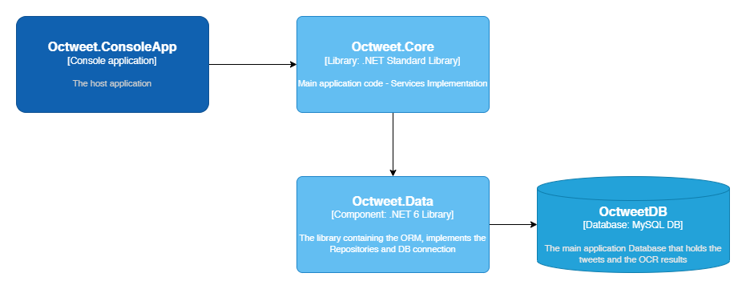

# The Octweet application

The actual application is written in C# language, on top of Microsoft's .NET platform, specifically .NET 6.

It is a console application that can run indefinetely and consists of two separate [Worker Services](https://docs.microsoft.com/en-us/dotnet/core/extensions/workers). The approach was chosen as the work needed to be done doesn't involve a user inferface (UI), and we would like a long-running service that can be fired and process data in the background. It is in an extensible service in the .NET ecosystem that leverages all the useful features, like logging, configuration, and dependency injection (DI).

## Architecture

The application is constructed using N-Tier architecture, with the `Octweet.ConsoleApp` acting as the presentation layer and the host of the application. In `Octweet.Core` libary we can find all the actual Business layer related implementations, and in the `Octweet.Data` libraray we will find all the database-related code.

The `Octweet.ConsoleApp` acts as the dependencies registration container and loads the application configuration.

Additionally, in order to avoid coupling between the components of the application and to avoid circular references between the separate libraries, we added the `Octweet.Core.Abstractions` and `Octweet.Data.Abstractions` libraries, which mainly contain pure model definitions or service/repository interfaces, respectively. This way we the Core layer/library does not need to know the specific Database implementation and can only depend on the repository interface.

## Services

The two separate worker services in our application are running in the background and are being activated with a configured interval. Currently the interval is 60 seconds.

### Twitter Scrapper Worker Service

The Twitter Scrapper service resides in `Octweet.Core` library, and on each execution, it uses the `ITwitterService` interface (from `Octweet.Core.Abstractions`) to fetch the latest tweets.

The actual implementation of the `ITwitterService` interface is `TwitterService`, which lives in `Octweet.Core`.

The following steps are executed:

- Fetch the query to search in the Twitter API from configuration, and construct the final query, by always appending a filter `has:images`, so that we fetch only the tweets that contain images
- Fetch the latest execution information from our `IQueryLogRepository`, for this specific query. The `IQueryLogRepositoy` is an abstraction around the actual repository which connects to the database, and the `QueryLog` table. It contains the latest tweetId we have saved for this query.
    - If this tweet is older that 7 days, we do not specify anything else in our query and fetch all the tweets we can find. This logic was added to work around a restriction in the Twitter v2 API, regarding the results of the Search API.
    - Else, we add this tweet's ID in the search parameters so that we fetch only tweets later than this one.

- We use the external library TweetInvi, using the credentials loaded in the configuration of the app, to fetch the results of our search.
- Gather all the results, if the results are in more than one pages. More info for Twitter pagination: [Pagination](https://developer.twitter.com/en/docs/twitter-api/pagination)
- Map the results into the object model of the Data schema we have defined. This schema lives in `Octweet.Data.Abstractions` library.
- Save the results in the database using the `ITweetRepository` interface, which, again, lives in `Octweet.Data.Abstractions` library.
    - This operation creates rows both in `Tweet` and also `TweetMedia` table
- Update the QueryLog table using the `IQueryLogRepository` interface with the latest tweet of this execution.

### Google Vision Worker Service

The Google Vision Worker Service also resides in `Octweet.Core` library, and on each execution, it uses the `IAnnotationService` interface (in `Core.Abstractions`) , which is implemented in `GoogleVisionService` (in `Core`).

In this service, we use an `ITweetRepository`, an `IAnnotationRepository`, and an ImageAnnotatorClient from the `Google.Cloud.Vision.V1` external library.

When this service is fired, the following steps are executed:

- Use the `ITweetRepository.FetchUnprocessedTweetMedia()` method in order to retrieve the images we have stored in the database for which we have not executed an image annotation yet.
- For each one of them, construct the parameters required by the Google library, by specifying the permanent public URL for each image.
- Send the request and await response from the Image Annotation service, having requested a `DetectDocumentText` process to run on the image.
- Update the database with the results:
    - Create a new row in `EntityAnnotations` table with the result
    - Update the respective row in `TweetMedia` table, with the `AnnotationId` column having the row Id of the `EntityAnnotations` table, and the `ProcessedAt` column having the current timestamp (in UTC)

---

[Go back to main Readme file](/README.md)