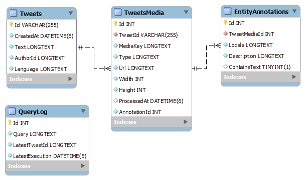

# Database

The database used by our application is running in a MySQL server instance, living inside a Docker container, for easier setup and provisioning.

The schema of the database is generated in a code-first manner by the .NET application, using the EntityFramework Core ORM. The tables were designed as classes, named the `EF Core model`, and the ORM is configured to create the appropriate schema, with incremental changes between the versions of the models.

During development, the changes were incremental and we used separate `Migrations` that gradually updated the schema (tables, columns, relationships, etc.). 

During runtime, on startup of the application we ensure that the Model and the Database are synced, and if the database in the configured server does not exist, the schema is created on that moment. No change will occur if the database already exists.

## Schema

## Tables

### `Tweets`

This table stores the search results of the queried tweets. It contains a subset of the properties returned from the Twitter API, most notable being the `Id` (the identifier of each tweet object), `CreatedAt` (the UTC timestamp of the tweet creation) and `Text` (the content of the posted tweet).

| Field | Type | Null | Key |
| --- | --- | --- | --- |
| Id | varchar(255) | NO | PRI |
| CreatedAt | datetime(6) | NO |  |
| Text | longtext | NO |  |
| AuthorId | longtext | NO |  |
| Language | longtext | NO |  |

### `TweetsMedia`

This table stores the media that are linked with each tweet, and holds a FK to the `Tweets` table, using the `TweetId` column. Generally, media objects can be photos, GIFs, or videos, but we are filtering the media that we store in our database and are only storing media of `Type`: `photo`.

The `MediaKey` column contains the unique identifier of each media object and in the `Url` column we store the static URL of each image.

The `AnnotationId` holds a one-to-one reference to the `EntityAnnotations` table, as described below, and the `ProcessedAt` column contains the timestamp when we processed the image using our OCR service (Google Vision API).

| Field | Type | Null | Key |
| --- | --- | --- | --- |
| Id | int | NO | PRI |
| TweetId | varchar(255) | NO | MUL |
| MediaKey | longtext | NO |  |
| Type | longtext | NO |  |
| Url | longtext | NO |  |
| Width | int | NO |  |
| Height | int | NO |  |
| ProcessedAt | datetime(6) | YES |  |
| AnnotationId | int | NO |  |

### `EntityAnnotations`

This table holds the data that we retrieved from the Google Vision API for each image we process. 

If an image does not contain any text, we save a row with the value of `0` in the column `ContainsText`, so we can filter them out.

The `Description` column contains the text that was detected in the image, and the `Locale` contains the language that was recognized by Google's Text Detection API.

| Field | Type | Null | Key |
| --- | --- | --- | --- |
| Id | int | NO | PRI |
| TweetMediaId | int | NO |  |
| Locale | longtext | NO |  |
| Description | longtext | NO |  |
| ContainsText | tinyint(1) | YES |  |

### `QueryLog`

This table serves as a tracking log for each separate search we perform. The `Query` column contains the search query, and for each query we perform, we mark when was the `LatestExecution` and what is the `LatestTweetId` we have stored for that query.

This supports a mechanism that is implemented in the application that makes it idempotent, as it can be run constantly without saving the same tweets more than once, and also allows us to stay well below the usage limits of the Twitter API.

| Field | Type | Null | Key |
| --- | --- | --- | --- |
| Id | int | NO | PRI |
| Query | longtext | NO |  |
| LatestTweetId | longtext | NO |  |
| LatestExecution | datetime(6) | NO |  |
