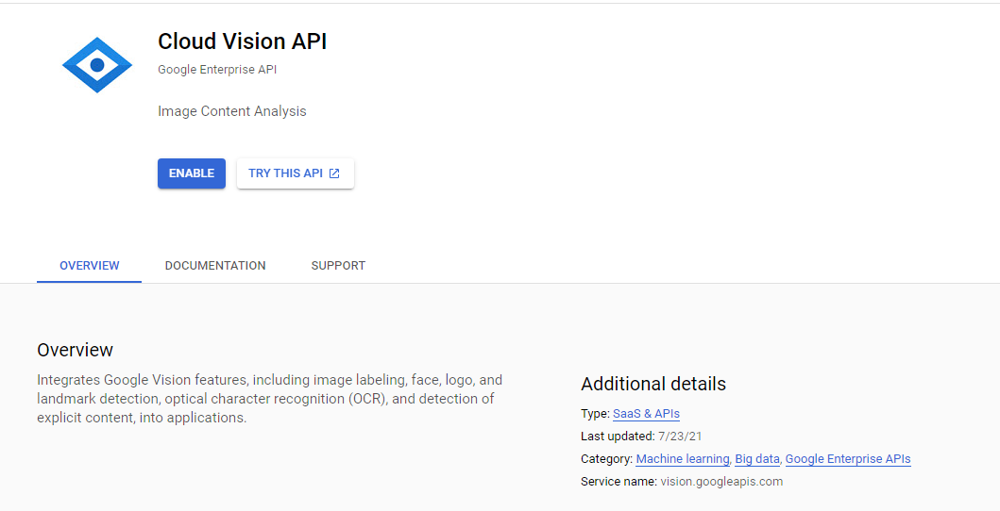
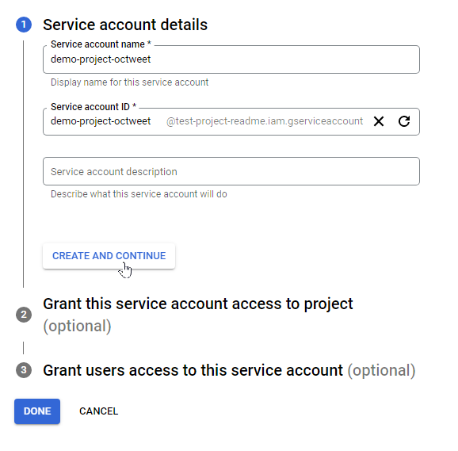
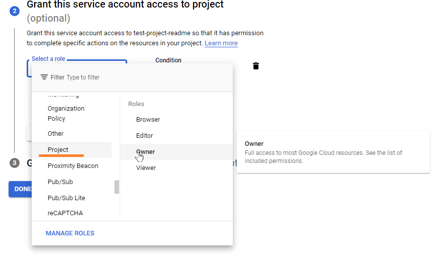
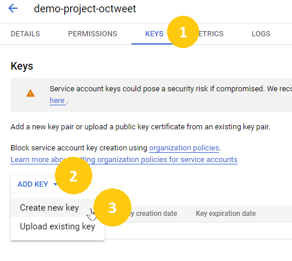

# Creating Google Vision API credentials

We will use the Google Vision API in order to handle the Optical Character Recognition (OCR) of each image in our queried Twitter posts.

For this task, we will use the Document Text Detection [feature](https://cloud.google.com/vision/docs/reference/rest/v1/Feature#type) of the Vision API.

For reference, this is the distinction between the Document Text and Text detection modes:

|Mode|Description|
|---|---|
|`TEXT_DETECTION`| Run text detection / optical character recognition (OCR). Text detection is optimized for areas of text within a larger image; if the image is a document, use `DOCUMENT_TEXT_DETECTION` instead.|
|`DOCUMENT_TEXT_DETECTION`| Run dense text document OCR. Takes precedence when both DOCUMENT_TEXT_DETECTION and TEXT_DETECTION are present.|

As we will be dealing with images containing newspaper frontpages, the dense text document OCR is more appropriate for our task, so the feature we used is the Document Text Detection.

## Create a Google Cloud account and credentials for the Cloud Vision API

We can use a free [Google Cloud](https://cloud.google.com/free) account, which also contains $300 in credits for 90 days to use in cloud products.

1. As a first step, we will need to set up a [new project](https://console.cloud.google.com/projectselector2/home/dashboard) in `Google Cloud Console` and have it selected as default project for the following steps.
2. After it's created, you can either use this [link](https://console.cloud.google.com/flows/enableapi?apiid=vision.googleapis.com&redirect=https://console.cloud.google.com) to enable the required Vision API access, _or_ add it manually:
    - Navigate to the Cloud Vision API [page](https://console.cloud.google.com/apis/library/vision.googleapis.com)

      
    - `ENABLE` the API for your project.
3. To access this API from a separate client, we will need a service account:
    - Go to [Create service account](https://console.cloud.google.com/projectselector/iam-admin/serviceaccounts/create?supportedpurview=project) page
    - Select the project you created
    - Select a service account name (you can also fill a description if you want) and click `Create and Continue`

      
    - In the next step, provide the `Project > Owner` role and click `Continue`:

      
    - Click `Done` to finish creating the service account
4. We will now create the key for the service account.
    - Click on the email on the service account you created in the last step. If you navigated away, you can find the correct page here: [Service Accounts](https://console.cloud.google.com/iam-admin/serviceaccounts) and select your project.
    - Click `Keys`, followed by `Add Key`, and select `Create new key`:

      
    - Leave the default option `JSON` selected and click `Create`. This will download a JSON key file which is the key we will use for the Octweet Application.

Store the JSON key file in an easily accessible path, preferably a short one, as we will update our `.env` file in order to load it in the docker image running the application.

You can also view the above guide [here](https://cloud.google.com/vision/docs/before-you-begin).

[Go back to main Readme file](/README.md)

## Further Resources

- Cloud Vision AI Home Page: https://cloud.google.com/vision/?hl=en_US
- How-to Guide: Setting up Cloud Vision API credentials: https://cloud.google.com/vision/docs/before-you-begin
- C# Google.Cloud.Vision Library Reference: https://cloud.google.com/dotnet/docs/reference/Google.Cloud.Vision.V1/latest/index